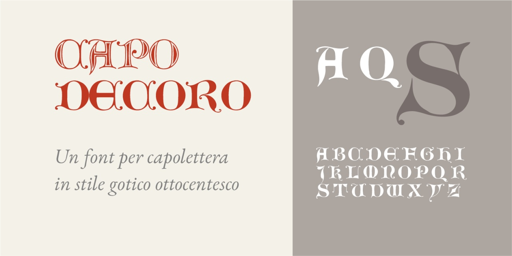
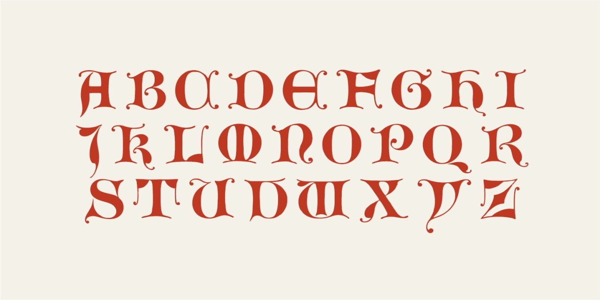
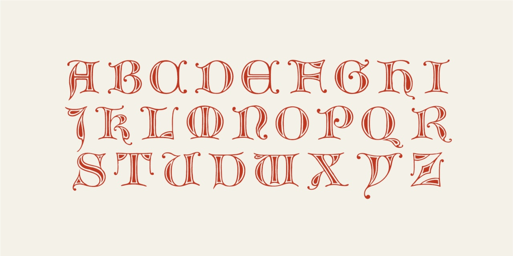

# Capo Decoro
- Versione 1.0: versione iniziale

Per testare il font, vedere la [pagina interattiva](https://m-casanova.github.io/CapoDecoro/).

## Descrizione

Il font "Capo Decoro" è derivato da un alfabeto pubblicato in _[Muster-Alphabete](https://archive.org/details/musteralphabetev02unse/page/n15/mode/2up)_ nel 1880.

Sono disponibili solo i caratteri maiuscoli da A a Z.

È presente una versione alternativa tramite caratteristica 'ss01'.

